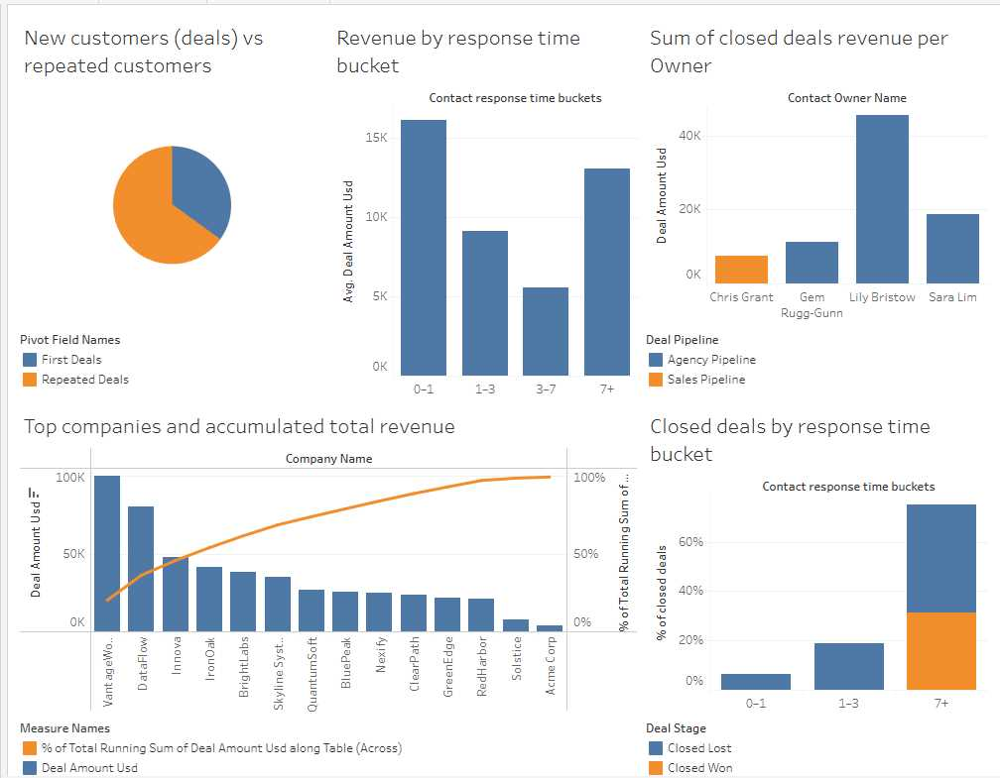
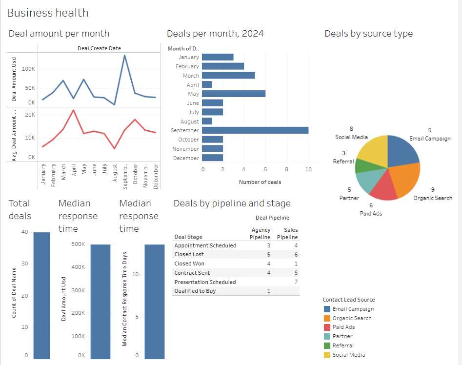

# 🧩 HubSpot CRM Data Analysis (SQL + Dashboard)

📊 **Objective**  
Analyze CRM data exported from HubSpot to uncover insights about deal volume, lead sources, pipelines, response times, and customer behavior.  
This project simulates a **marketing and sales operations analyst** workflow — transforming flat CRM exports into actionable intelligence.

All SQL exploration and metrics are documented in [`SQL_Queries.md`](SQL_Queries.md). 
Final dashboard - Overview: [Tableau interactive overview dashboard](https://public.tableau.com/app/profile/lucio.colombo/viz/HubspotCRManalysis/Dashboard1) 
Revenue analysis dashboard: [Tableau interactive revenue analysis dashboard](https://public.tableau.com/app/profile/lucio.colombo/viz/Revenueanalysis_17606668305090/Dashboard2) 

If links are non functional, refer to the images below:

   
  

---

### 💡 Context

HubSpot’s free tier offered very limited dashboard and reporting functionality, which heavily restricted analytical depth and customization.  
To overcome these limitations, I migrated the dataset to **BigQuery** for SQL-based exploration and connected it to **Tableau** for interactive visualization and trend analysis.

_Initial Hubspot Dashboard before migration to Tableau_

---

## 📦 Dataset

**Source:** HubSpot CRM export (`hubspot-crm-analysis.export.users`)  
**Rows:** ~300  
**Fields:**  
`deal_create_date`, `deal_stage`, `deal_pipeline`, `deal_amount_usd`,  
`contact_lead_source`, `contact_owner_name`, `contact_response_time_days`,  
`company_name`, `company_domain`

The dataset represents a sample CRM deal table combining marketing, sales, and company attributes.

---

## 🧾 SQL Analysis Overview

All SQL exploration and metrics are documented in [`SQL_Queries.md`](SQL_Queries.md).  
Each query includes its business question and output reference.

| Section                    | Key Question                                   | Focus                              |
| :------------------------- | :--------------------------------------------- | :--------------------------------- |
| 1. Volume                  | How many deals are created per month?          | Pipeline health trend              |
| 2. Source Mix              | Which lead sources generate most deals?        | Marketing attribution              |
| 3. Pipeline Mix            | What is the distribution across pipelines?     | Operational segmentation           |
| 4. Stage Snapshot          | What is the current deal stage breakdown?      | Sales stage funnel                 |
| 5. Deal Value              | What are total and average deal amounts?       | Revenue analysis                   |
| 6. Value by Segment        | Which source-pipeline pairs drive most value?  | High-performing channels           |
| 7. Owner Performance       | Which reps close more deals and value?         | Team comparison                    |
| 8. Response Time Quality   | How fast do we respond to leads?               | Lead management quality            |
| 9. Response Time Impact    | Does response speed affect outcomes?           | Correlation of response vs results |
| 10. New Logos              | How many new companies buy each month?         | Acquisition tracking               |
| 11. Repeat Business        | What share of companies return for more deals? | Retention analysis                 |
| 12. Source → Pipeline Path | How do lead sources map into pipelines?        | Channel flow                       |
| 13. Top Opportunities      | Which are the largest open deals?              | Active deal monitoring             |
| 14. Company Coverage       | Are deals concentrated in few clients?         | Revenue dependency                 |
| 15. Data Quality Checks    | Are there missing or inconsistent fields?      |

---

## 📈 Dashboard Highlights

The accompanying dashboard visualizes the SQL results in a clean analytical layout:

[Tableau interactive dashboard](https://public.tableau.com/app/profile/lucio.colombo/viz/HubspotCRManalysis/Dashboard1)

_(Dashboard built in Tableau)_

---

## ⚙️ Tools & Stack

-  **BigQuery SQL:** Core data querying and transformations
-  **Google Sheets / CSV:** Initial HubSpot export storage
-  **Tableau:** Dashboard and visuals
-  **GitHub:** Documentation and versioning

---

## 📚 Key Learnings

-  Structuring flat CRM exports for analysis
-  Using window functions for cumulative trends
-  Computing cohort-based repeat rates
-  Segmenting pipelines and sources for attribution
-  Evaluating response time impact on deal outcomes
-  Performing quick data-quality diagnostics with SQL

---

## 🧠 Insight Summary

-  **Deal volume and value** show steady growth over time, with visible peaks in early and late 2024.
-  **Email Campaigns** and **Organic Search** remain top sources, but **Paid Ads** generate higher-value deals on average.
-  **Faster responses (0–3 days)** still outperform slower ones (7+ days) in close rate and deal value — confirming the speed–conversion link.
-  **Repeat customers** represent a smaller share of total deals but drive significant recurring revenue.
-  **Revenue concentration** remains moderate: roughly **40% of total value comes from the top 5 companies**, as shown in the Pareto chart.

---
